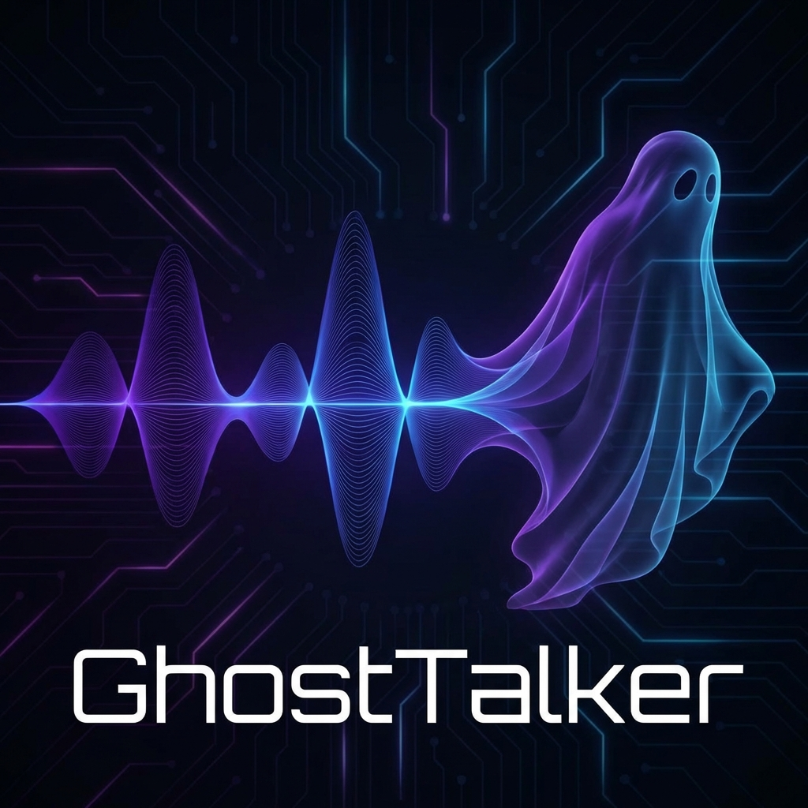

<p align="center">
  
</p>

<h1 align="center">🎙️ GhostTalker: The Eternal Echo</h1>

<p align="center">
  
  
  
  
</p>

---

<p align="center">
  <b>"Memory is a ghost, and the voice is its heartbeat."</b><br>
  <i>A high-fidelity, neuro-synaptic voice cloning engine designed to capture, refine, and resurrect the unique essence of human speech.</i>
</p>

---

---

> 🤖 **Neural Warning**: This README was "ghostwritten" by an AI agent. The code is 100% hardware-optimized, but the hype is 100% GPU-hallucinated.

---

## ⚡ The Fixes (RTX 2050 Optimized)
Originally from [jianchang512/clone-voice](https://github.com/jianchang512/clone-voice), resurrected to actually work:
- 🛠️ **CUDA 12.1**: Fixed `cublas64_12.dll` errors for new NVIDIA cards.
- 🧪 **VRAM Alchemy**: Runs on **4GB VRAM** via `float16` and compressed model hacks.
- 🛡️ **No-Crash Training**: Patched the Pydantic floating-point bug.
- 🏎️ **Instant Echo**: Forced 10s reference windows for faster cloning.
- 🌍 **Global Logic**: English-first UI + `pypinyin` fix for stability.

---

## 🛠️ Dark Arts (Setup)

### 1️⃣ Summon the Environment
```bash
python -m venv venv
.\venv\Scripts\activate
pip install -r requirements.txt
```

### 2️⃣ The GPU Catalyst
```bash
# Force the high-performance CUDA 12.1 engine
pip install torch torchaudio torchvision --index-url https://download.pytorch.org/whl/cu121 --force-reinstall
```

### 3️⃣ Ignition
| Mode | Command |
| :--- | :--- |
| **Training Phase** | `.\runtrain.bat` |
| **Generation Phase** | `python app.py` |

---

## 🕸️ The Workflow
1.  **Step 1 (The Capture)**: Upload your target audio. GhostTalker slices and transcribes the soul.
2.  **Step 2 (The Ascension)**: Neural training begins. Optimized for 40-minute burn-in.
3.  **Step 3 (The Echo)**: Real-time synthesis testing.
4.  **Step 4 (The Integration)**: Merge the model into your live application.

---

## ⚖️ Ethical Scroll
GhostTalker is a powerful tool for creativity, accessibility, and preservation. **Use it with respect.** Do not use these echoes to deceive, harm, or impersonate without consent.

---

<p align="center">
  <i>Hand-crafted with passion and neural optimization.</i><br>
  <b>Maintained by <a href="https://github.com/shantoshdurai">shantoshdurai</a></b>
</p>